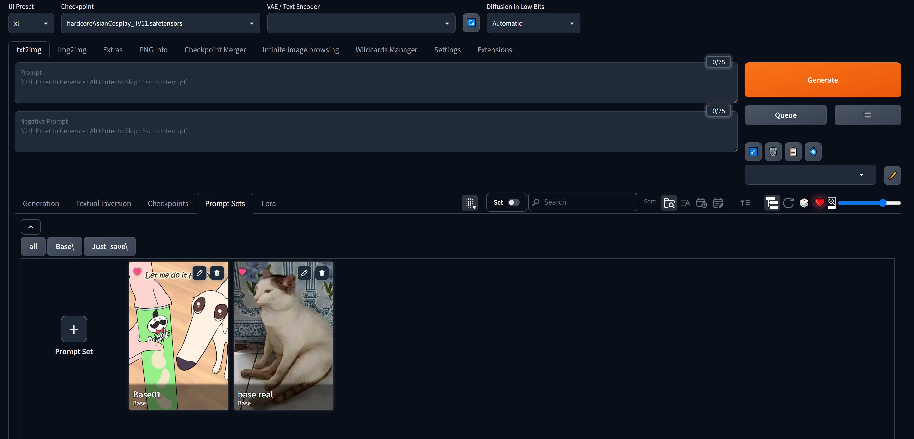
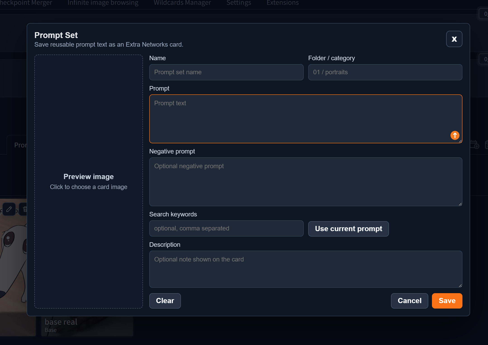
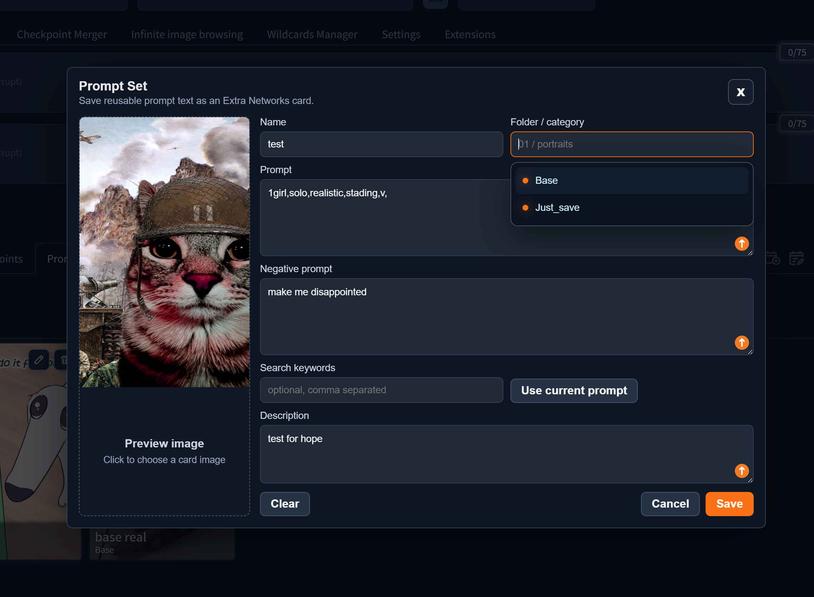
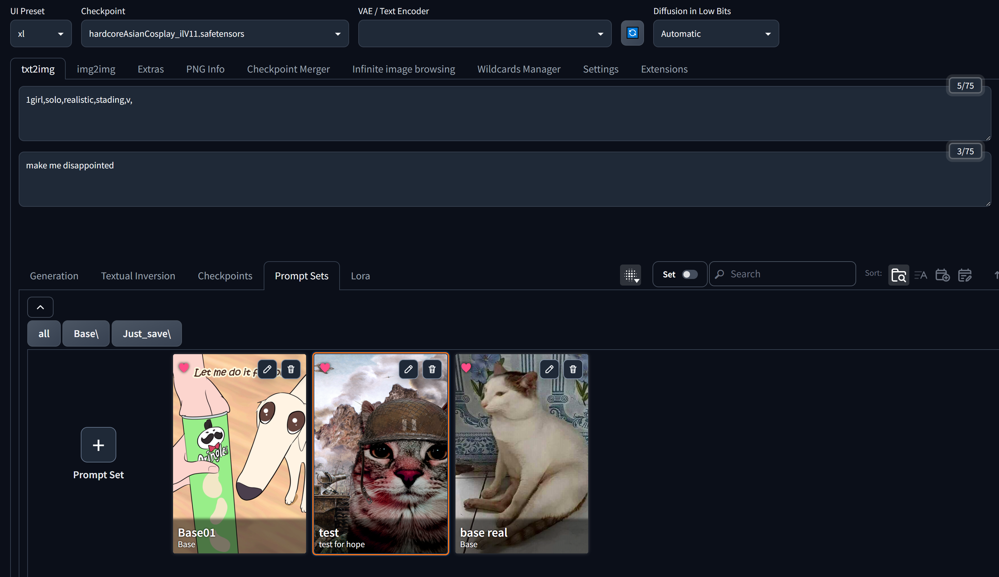
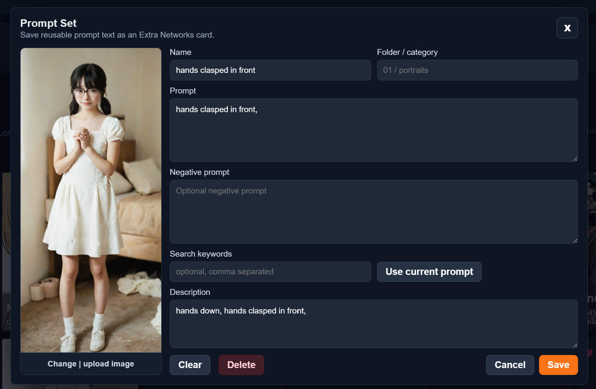
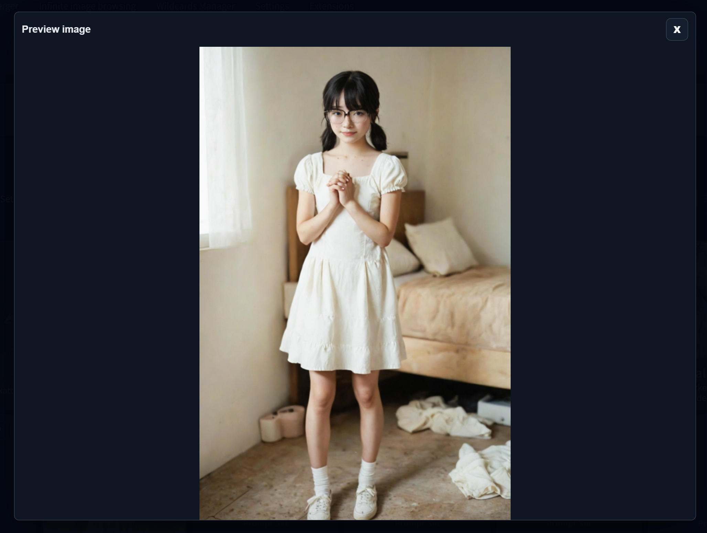

# Forge Prompt Sets

Forge Prompt Sets adds a small **Prompt Sets** tab to the Forge/A1111 Extra
Networks panel. It lets you save reusable prompt text as cards, then click a
card later to insert that prompt into txt2img or img2img.

It is intentionally simple: make prompt cards, search them like normal Extra
Networks cards, and reuse them without keeping prompts in a separate note file.

## Screenshots

### Prompt Sets tab



Prompt sets appear as Extra Networks cards in their own tab.

- Click the `+ Prompt Set` card to create a new prompt set.
- Use the normal Extra Networks search box to find saved prompt sets.
- Use folder buttons to narrow the list by folder/category.
- Existing cards show edit and delete buttons on the card.

### Create a prompt set



The editor saves one reusable prompt card.

- `Name` becomes the card title.
- `Folder / category` places the card into a folder button.
- `Prompt` is inserted into the main prompt when the card is used.
- `Negative prompt` is optional and is inserted into the negative prompt box.
- `Search keywords` can add extra words that help the card show up in search.
- `Description` is shown on the card as a short note.
- Click the preview area to choose a card image.
- `Use current prompt` fills the editor from the current prompt fields.

### Folder suggestions and editing



When editing or creating a card, the folder field can suggest existing folders.

- Pick an existing folder from the suggestion list, or type a new one.
- Folders are stored as subfolders under `prompt_sets/`.
- Renaming the card or folder updates the saved prompt set file.
- Use `Save` to update the card without restarting the WebUI.

### Use a saved prompt set



Click a prompt set card to apply it.

- The saved prompt text is added to the main prompt box.
- If the card has a negative prompt, it is added to the negative prompt box.
- The active card is highlighted while its text is applied.
- Click the same card again to remove the text that card added.
- Prompt sets keep the normal Extra Networks card layout and search behavior.

## Update




- 6/9/26 update image preview modal

## Features

- Save reusable prompt cards from the Extra Networks panel.
- Insert prompt and optional negative prompt text with one click.
- Remove the inserted text by clicking the active card again.
- Search prompt sets with the normal Extra Networks search field.
- Organize prompt sets with folders/categories.
- Add preview images, descriptions, and extra search keywords.
- Edit or delete prompt sets from the card controls.
- Fill the editor from the current prompt with `Use current prompt`.

## Installation

Clone this repository into the Forge extensions folder, then restart the WebUI.

```bash
cd /path/to/sd-webui-forge/extensions
git clone https://github.com/Merueru/forge-prompt-sets.git
```

## Data

Prompt sets are stored locally in:

```text
prompt_sets/*.json
prompt_sets/*.preview.png
```

Folder/category values are stored as subfolders under `prompt_sets/`.

These files are user data. They are ignored by git by default, except for the
empty `prompt_sets/.gitkeep` placeholder.

## Notes

- This extension does not change the main generation layout.
- It only stores prompt text, optional negative prompt text, preview images,
  descriptions, folders, and search keywords.
- Prompt sets are local to your Forge installation unless you back them up or
  copy them yourself.
